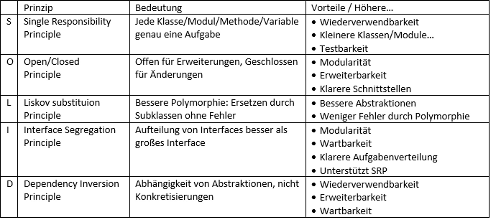

## This contains some requirements with explanation for the ASE project

 

# Clean Architecture

Die eigentlich Anwendung, technologie-unabhängig im Kern
Außenrum sind Sachen wie Datenbanken GUI usw
Abhängigkeiten von außen nach Innen, Aufrufe zur Laufzeit können beidseitig sein
-> Innere Schicht weiß nichts von der äußeren

Je konkreter der Code ist, desto weiter außen liegt er

**Schicht 4**: mathematische Konzepte, Schicht häufig nicht notwendig
 

**Schicht 3**: v.a. Entities, Geschäftslogik
 

**Schicht 2**: anwendungsspezifische Geschäftslogik, steuert den Fluss der Daten und Aktionen von und zu den Entities, spezifisch für die Anwendung, Änderungen an dieser Schicht beeinflussen Schicht 3 NICHT
 

**Schicht 1**: Diese Schicht vermittelt Aufrufe und Daten an die inneren Schichten, bereitet Daten für Benutzeroberfläche vor
 

**Schicht 0**: greift nur Auf die Adapter zu, Benutzeroberfläche, wenig Code (Delegationscode an Adapter)

Konkrete Implementierung: entweder pro Schicht ein package oder ein eigenes Projekt

# DDD (Domain Driven Design)

Hauptbestandteile: UL, VO, Entities
 
 

### UL (Ubiquitous Language, wichtigstes Konzept des DDD)

Erstellen von Glossar für UL

Artefakte mit Projektsprache:

- Anforderungsdokument bzw. Anforderungen
- Benutzerhandbuch
- Fehlerberichte und Change Requests
- Benutzeroberfläche
- Fachmodell (Domänenmodell)
- Softwaredesign (Klassen- und Methoden)
- Sourcecode (Implementierung)
- Entwicklungsinterne Kommunikation (Issues)
   

### Value Objects

- Kapselt ein Wertekonzep, wie Klasse Planet: Masse, Radius,…
- Sind unveränderlich
- Klasse als final deklarieren, alle Attribute sind automatisch final
   

### Entities

- Veränderlich
- gleiche Daten != gleiches Entity
- eindeutig identifizierbar durch natürliche oder Surrogatschlüssel
- Entities sollten so viel wie möglich in VO auslagern
   

### Aggregate

- beinhalten ein oder mehrere Entities bzw. Value Objects
- ein Entity ist Aggregat Root (AR) und verwaltet alle Zugriffe auf das Aggregat und stellt dabei sicher, dass Domänenregeln eingehalten werden
   

### Repository

- Zugriff auf Speicher wird von Repository verborgen
- normalerweise pro Aggregat ein Repository
- Repositories geben immer AR des Aggregats zurück
- Definition (techn. Interface) ist Teil des Domain Codes, implementiert wird es außerhalb
   

### Factories

- einziger Zweck: Erzeugen von Objekten

# Programmierprinzipien

### SOLID

 

### GRASP (General Responsibility Assignment Software Patterns)

**Low Coupling**: geringe Abhängigkeit zwischen Objekten
 

**High Cohesion**: Hohe semantische Nähe der Elemente einer Klasse
 

### DRY

Don’t repeat yourself
